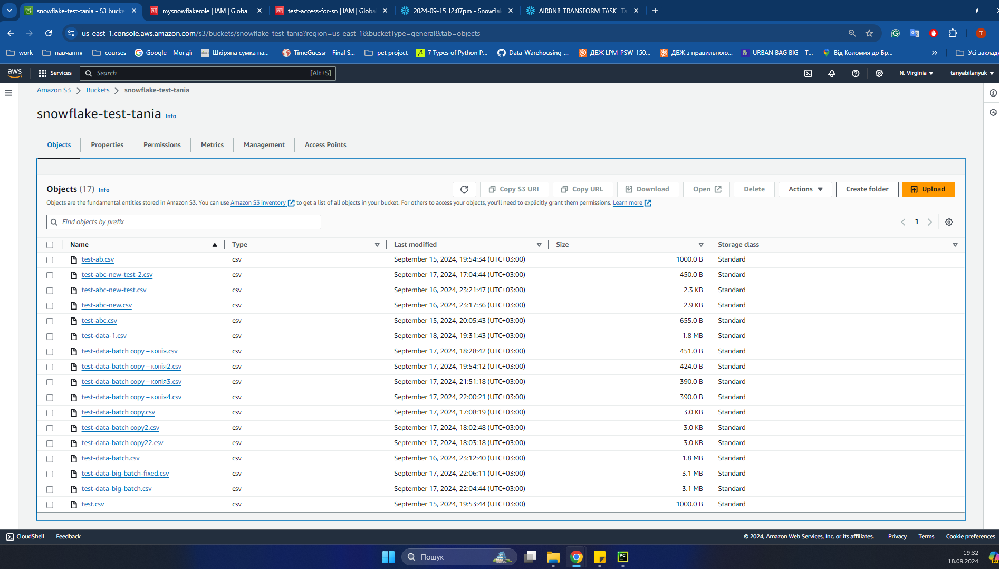
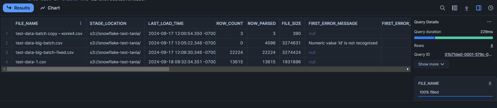
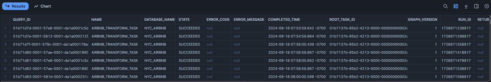
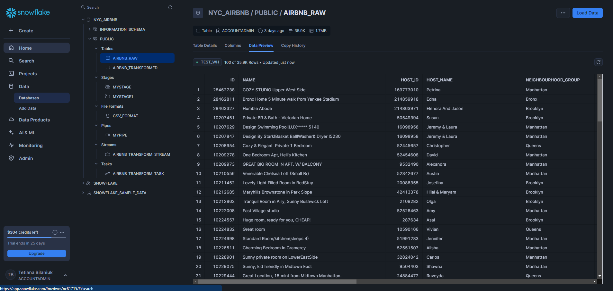
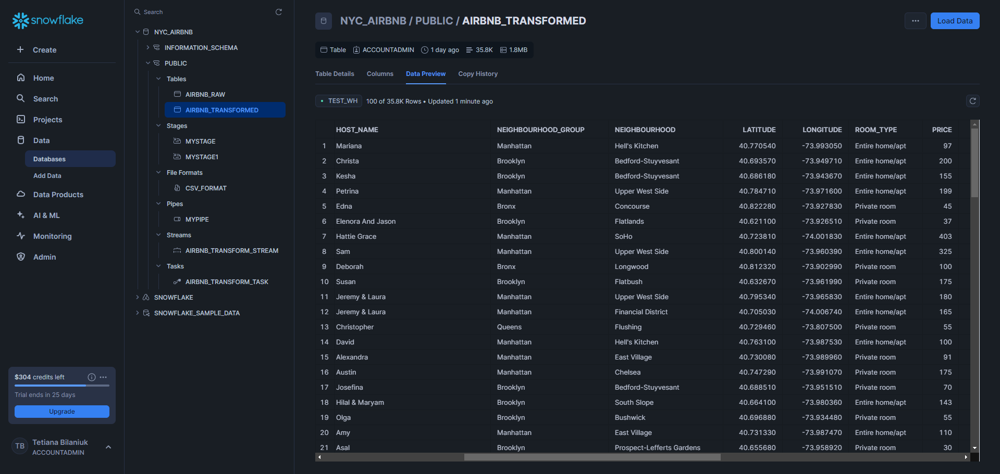

# Snowflake homework

This is a Snowflake ETL pipeline that automates the process of ingesting and transforming data from AWS S3 bucket using Snowpipe, Snowflake Streams and Tasks.

To use this worksheet you need to do the following:
1. [Configure policy](https://docs.snowflake.com/en/user-guide/data-load-snowpipe-auto-s3#creating-an-iam-policy).
2. [Create IAM Role](https://docs.snowflake.com/en/user-guide/data-load-snowpipe-auto-s3#step-2-create-the-iam-role-in-aws) and link it to storage integration.
3. [Configure trust policy](https://docs.snowflake.com/en/user-guide/data-load-snowpipe-auto-s3#step-5-grant-the-iam-user-permissions-to-access-bucket-objects).

All configuration steps for Snowflake side and usage examples with explanation  are in `worksheet.sql` file. 

### S3 bucket with files

### Ingestion results for past 24 hours:

### Task execution history:

### Raw data preview:

### Transformed data preview:
